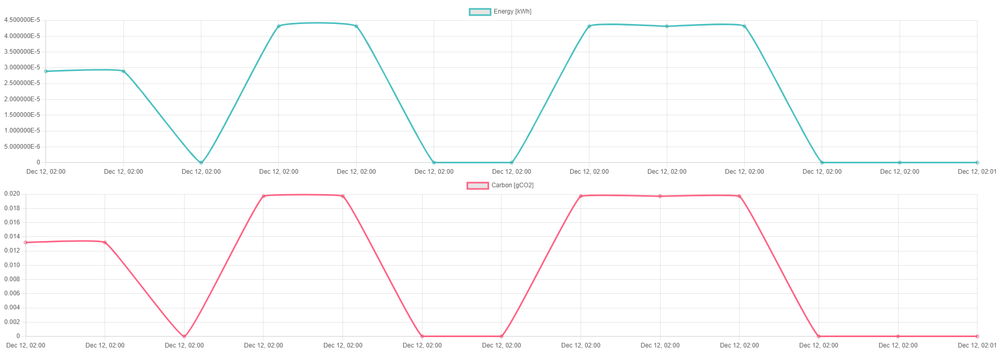
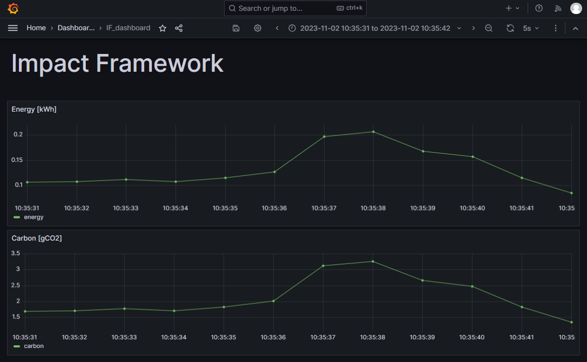

# How to Visualize results

_(for any questions / help needed on IF visualization please _email: pazbarda@gmail.com_)_

There are currently 2 ways to visualize Impact Framework outputs:
1. Using the **Simple HTML Exporter plugin**.
2. Using **Grafana**.

**Grafana** is the more standardized method for visualization. It also provides much more control over what's being visualized and how. Nevertheless, it requires some setting up.

Using the **Simple HTML Exporter plugin** is much simpler as it only requires a single configuration in the manifest yml file. However, it only supports visualization of Energy and Carbon values over time. 
If you need to visualize other output parameters you can either use **Grafana** or alternatively enhance the **Simple HTML Exporter plugin** to be a bit less simple...

## Simple HTML Exporter plugin

(see full documentation here: <URL TBD>)

### Input

`energy`[kWh], `carbon`[gCO2] and `timestamp` should be included in the input array items.

### Output

This plugin acts as a relay, returning the input as-is, with the generated HTML acting as a "side effect".

### Example impl

```yaml
name: simple-html-exporter-demo
description:
tags:
initialize:
  models:
    - name: simple-html-exporter
      model: SimpleHtmlExporter
      path: "@grnsft/if-models"
graph:
  children:
    child:
      pipeline:
        - simple-html-exporter
      config:
        simple-html-exporter:
          html-path: /usr/local/data/html-export.html
      inputs:
        - timestamp: '2021-01-01T00:00:00Z',
          energy: 0.00001841,
          carbon: 0.0104062,
```

### Visualization example

The resulting HTML file can then be viewed using a web-browser




## Grafana

(See also https://grafana.com/)

**Grafana** is an open source analytics & monitoring solution for every database.

One of its main features is the ability to create dashboards with various types of data visualizations.

Please follow these instructions [here](https://github.com/Green-Software-Foundation/if/blob/dev/grafana/IF_GRAFANA_SETUP.md) to set up a **Grafana** dashboard.

This method requires converting the resulting output yml into a CSV. The standard way to do so would be to use the [CSV export](https://github.com/Green-Software-Foundation/if-models/tree/main/src/lib/csv-export) plugin.

### Visualization example



